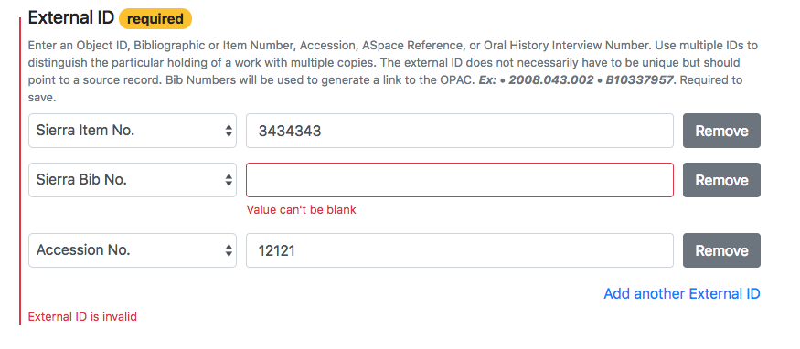

# Form Support

Kithe provides some support for creating HTML edit forms with common tricky use cases. It is based on [simple_form](https://github.com/plataformatec/simple_form) -- if you are new to simple_form, reading up on it is recommended. K

Kithe provides it's own `Kithe::FormBuilder` simple_form builder, with added kithe functionality, which you can use automatically with the provided helper method `kithe_form_for` instead of `simple_form_for`.  Some of the generated HTML assumes bootstrap 4 -- [include bootstrap](https://github.com/twbs/bootstrap-rubygem) in your app, and generate bootstrap 4 simple_form configuration with `rails generate simple_form:install --bootstrap`.  This will also generate configuration for a simple_form wrapper called `vertical_collection`, which kithe generators use as default.

This guide is about the form builder, but on the back-end see also Kithe's extensions to Rails "Strong Params", [Kithe::Parameters](../app/models/kithe/parameters.rb).

## Repeatable input fields

Your Kithe::Work or other Kithe::Models may use attr_json _array_ attributes -- either simple strings, or sometimes an array of nested/compound models. You want to to provide a form that lets the user add or remove these elements, to make multiples.

We provide a helper builder method, `repeatable_attr_input`, that lets you do this while constructing/styling the individual units however you want (for primitives or nested models), by wraps it in the boilerplate HTML (including hidden inputs sometimes) necessary to make the Javascript for adding/removing elements.

### Cocoon JS required

The approach is _based on_ [cocoon](https://github.com/nathanvda/cocoon, and **you need to include the cocoon JS in your app**. Normally, include cocoon gem, then `//= require cocoon` in your `application.js`.

We do _not_ use the the Cocoon rails helpers to generate HTML though, we use our own. Cocoon both did more than we needed (to handle alternate ORMs and actual Rails associations) and less (couldn't handle primitives out of the box). While it is possible to [get Cocoon to sort of work with attr_json](https://github.com/jrochkind/attr_json/blob/master/doc_src/forms.md#cocoon), it's kind of hacky. By supplying our own builder/renderer methods, we can make this work a lot smoother for kithe.  But it produces HTML that is compatible with cocoons, so cocoon JS still works (in future we could possibly provide our own JS instead. But cocoon JS hasn't changed much in years, and should keep working.)

Like cocoon, the kithe `repeatable_attr_input` method takes the HTML for a "new element", and puts it in a data-association-insertion-template attribute on the "add a new one" link.

As we only use the cocoon JS, you can use the cocoon NPM package alone without the cocoon gem --
or use another cocoon-compatible npm package that does not require jquery like cocoon does, see
cocoon README.

### Examples

#### Repeated model

Let's say you have a repeatable embedded model in your Work:

```ruby
class Inscription
  include AttrJson::Model

  validates :location, :text, presence: true

  attr_json :location, :string
  attr_json :text, :string
end

class Work < Kithe::Work
  attr_json :inscriptions, Inscription.to_type, array: true
end
```

And you want to provide a repeatable input field, where a repeatable unit includes both location and text fields.

```erb
# in .erb view code
<%= kithe_form_for(@work) do |form| %>
   <%= form.repeatable_attr_input(:inscription) do |sub_form| %>
      <%= sub_form.input :location, wrapper: horizontal_form, label: false %>
      <%= sub_form.input :title, wrapper: horizontal_form, label: false %>
   <% end %>
<% end %>
```

The resulting HTML form, as styled by a local app and shown with a validation error present, might look like:




* Note that `repeatable_attr_input` yields an argument that is very much like the "sub-form" argument in `fields_for` in ordinary rails builders -- you should use it for your sub-elements.

* Note that we include _one_ iteration of a "unit of content" there, `repeatable_attr_input` will repeat it as necessary for all actual content -- wrapped in proper HTML for a 'remove' button and an 'add' button, which all work properly with cocoon JS.

* Note that we specify the simple_form bootstrap `horizontal_form` wrapper there, to try to get something that looks okay repeated in our overall form. You can actually use whatever HTML you want here, to get it both semantically and presentationally appropriate, including via local template partials or helper methods.

* Note that if you use simple_form for the internal inputs, you can get _validation errors displayed in form_ in appropriate ways for those internal elements too. It just works.

* The text of the "add another" button can be altered using i18n, and uses activerecord i18n for the "thing name".

* Becuase kithe sets up all attr_json attributes to default to accepting nested attributes with `reject_if: :all_blank`, if you leave ALL the inner fields empty, they'll be ignored.
  * The params will actually be (eg) `inscription_attributes`, handled by an `inscription_attributes=` method on your models, which are already there for you. Similar to and based on [ActiveRecord nested attribute handling](https://api.rubyonrails.org/classes/ActiveRecord/NestedAttributes/ClassMethods.html) in general, but with attr_json.

#### repeatable primitive

Repeatable primitives don't work quite as well on a form -- you can't get individual input-specific validation errors for instance. But `repeatable_attr_input` supports them anyway.

If you only want a repeatable text box, you can simply not use a block argument:

```
<%= kithe_form_for(@work) do |form| %>
   <%= form.repeatable_attr_input(:array_of_strings) %>
<% end %>
```

You can also specify additional HTML attributes for the input tag, in standard Rails style, say if you need a data tag to trigger some JS functionality:

```
<%= kithe_form_for(@work) do |form| %>
   <%= form.repeatable_attr_input(:array_of_strings, html_attributes: { "data-something" => "value" }) %>
<% end %>
```

If you do need to customize the repeatable HTML unit -- say you need it to be a select menu instead of a text entry -- you can provide a block. The yielded block arguments are different: There's no sub-form-builder involved. Instead, yielded are a string input name you should use in whatever input you build, and the value to build the current unit with.

```ruby
<%= kithe_form_for(@work) do |form| %>
  <%= form.repeatable_attr_input(:array_of_strings) do |input_name, value| %>
    <%= form.input :array_of_strings,
       name: input_name,
       selected: value,
       collection: ARRAY_OF_POSSIBILITIES,
       id: nil # rails will generate a non-unique ID in this case if you let it
    %>
  <% end %>
<% end %>
```

#### build at least one

Sometimes we want at least one input unit to show up even if the model doesn't include any (often will be the case for creating new models). Just pass `build: :at_least_one` to `repeatable_attr_input`. Works for primitives or models.

    form.repeatable_attr_input(:some_attribute, build: :at_least_one)

Perhaps in the future we can support a build argument for "one extra blank one" no matter how many are already there, matching traditional samvera/hydra-editor UX. I'm not certain if that UX is actually desired by anyone.

Note that because of the `#{attribute_name}_attribute=` methods generated by Kithe::Model's use of `attr_json_config(default_accepts_nested_attributes: { reject_if: :all_blank })`, empty values (hashes with all empty values for models, empty strings for primitives) are filtered out on form assignment, so these extra inputs don't result in extra data persisted if submitted blank.

### Compare to

This is similar to and inspired by [hydra-editor](https://github.com/samvera/hydra-editor). I believe it is much more flexible and extendible than hydra-editor, especially in the way it uses an ERB block argument to allow whatever "unit" HTML the caller wants. I also think kithe `repeatable_attr_input` works better for compound/nested models, including with validation errors (and any model defaults) on screen with simple_form. I think our choice to use cocoon-style HTML escaped in a `data-association-insertion-template` make the code less fragile.

I think this code makes somewhat fewer assumptions about what's going on in your models or controllers too -- although it does assume ActiveRecord-style `_attributes=`. While currently the code is written assuming use of attr_json, we could probably remove that assumption/dependency, if there is interest, without too much added complexity.


